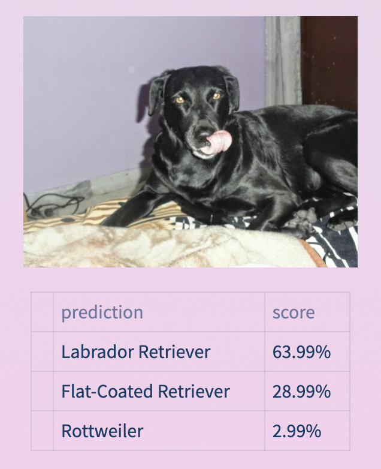
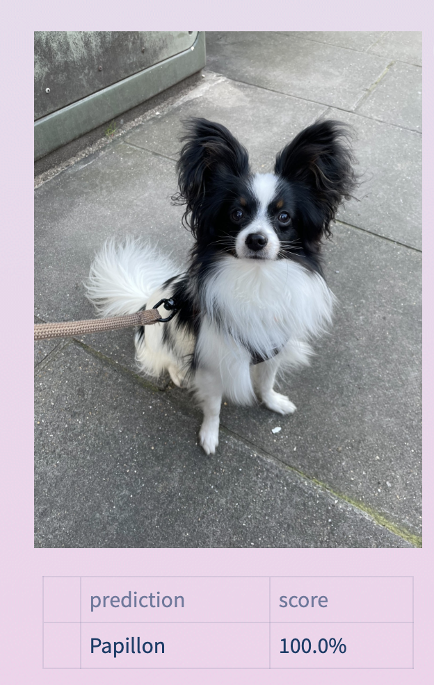
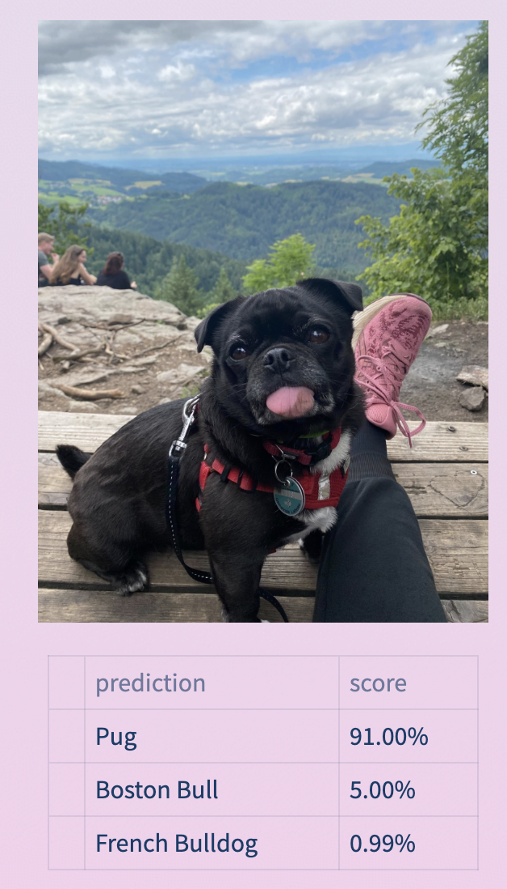

# Doggos-101 - The new dog breed classification App 🐶🐶🐶

Our App is available 🐶🐶🐶 [here](https://doggos-101.streamlit.app/) 🐶🐶🐶

This work is part of LeWagon's project week - Data Science batch #1181.

## Project overview 🚀

The goal of this project was to create an app capable of identifying the breed of a dog using a simple image as input.
To this end, we used a Convolutional Neural Network (CNN) trained on the [Stanford Dogs Dataset](http://vision.stanford.edu/aditya86/ImageNetDogs/).
Once the network was trained, we packaged the network into a Docker container to make it available as a web app via Google Cloud Run.

## The Dataset 🐶

The original dataset is available [here](http://vision.stanford.edu/aditya86/ImageNetDogs/). It contains 120 different classes of dog breeds, each class containing at least 100 images, which makes a total of 20,580 images.


## The Model 🧠

After testing different models, we decided to use an **InceptionV3** [model](https://www.tensorflow.org/api_docs/python/tf/keras/applications/inception_v3/InceptionV3), which is a pre-trained model on the ImageNet dataset. We then added a custom layer on top of it, which is a fully connected layer with 120 outputs (one for each class of dog breed). We then trained the model on the Stanford Dogs Dataset for 20 epochs, using a batch size of 32 and an Adam optimizer with a learning rate of 0.0001.

### The Metrics ⏱️

We used the **accuracy** as a metric to evaluate the model. The accuracy is the number of correct predictions divided by the total number of predictions. The accuracy of our model is **85.3%**.

### Improving the accuracy of the model 💪

We used data augmentation to perform transformation on the training dataset images. This allowed us to increase the size of the training dataset.

```
augment_model_1 = Sequential([
    layers.Input(shape = input_shape),
    augmentation,
    base_model,
    layers.Flatten(),
    layers.Dense(256, activation="relu"),
    layers.Dense(120, activation='softmax')
])
```


### Computer vision 💻

Here is an example of how the computer sees the images of dogs:


The different filters allow the computer to extract the features that characterize the dog breed. Once trained on the dataset, the model is able to recognize the dog breed based on these features.

## Results 📊

The accuracy of our prediction is **85.3%**, which means that in most cases we are able to predict correctly the dog breed.

Here are some examples of predictions:

        

Beside the predictions, we also scrapped the information of the [UK Kennel Club website](https://www.thekennelclub.org.uk/) to provide more information about the dog breed.
Hence together with the prediction, we provide also information about:

- the lifespan

- The recommended duration of exercise for the dog

- The frequency of grooming

- other informations...


## Important remarks 🚨

- Awareness of the dog’s breed (or mixture of breeds) and their possible character traits does not necessarily mean that the dog will behave the way it is common for the breed.

- The information provided by the app is not a substitute for professional advice. If you have any concerns about your dog’s health or behaviour, please consult your vet or a professional dog trainer.

- It is important to understand that this information is very general but each dog is special.
